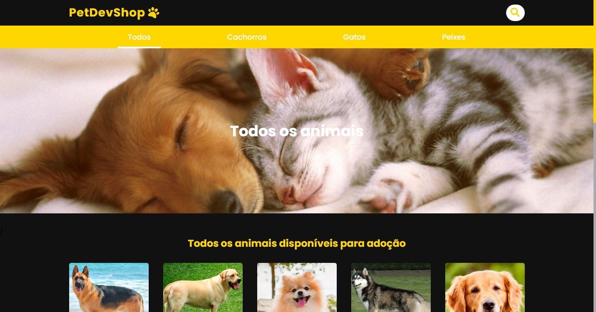
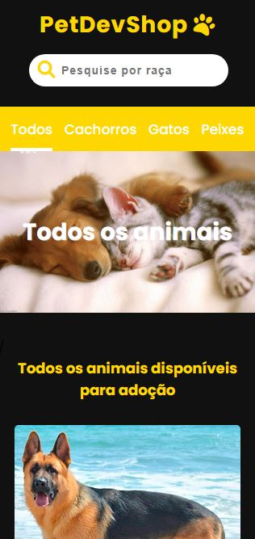

<div align="center">
  
</div>

---

<h1 align="center">🐕Canil</h1>
<h3 align="center">✔ STATUS: Concluído ✔</h3>

---

<h2 align="center">📖Sobre</h2>

<p align="center">Este projeto foi realizado em conjunto com o modulo de Node + Typescript da B7Web, ele consiste em uma pagina principal com vários animais, um menu para selecionar a categoria do animal e um campo de busca que faz uma busca pela raça do animal. Ele é 100% responsivo.</p>

---

<h2 align="center">✔O site contém:</h2>

✅ Animações<br>
✅ Campo de busca<br>
✅ Filtro<br>
✅ Navbar<br>
✅ Responsividade<br>
### etc...

---

## Pré-requisitos globais

```
npm i -g nodemon typescript ts-node
```

## Instalação

```
npm i
```

ou

```
npm install
```

## Para rodar o projeto

```
npm run s
```

<p>O projeto vai ser iniciado em <a target="_blank" href='http://localhost'>http://localhost</p>

<h2 align="center">🖥Preview</h2>

</img>
<br>
<br>
<br>
</img>

### Veja o projeto em funcionamento <a target="_blank" href="https://canilweb.herokuapp.com/">aqui</a>. 🧐

---

<h2 align="center">🛠 Tecnologias</h2>

- [Node](https://nodejs.org/en/)
- [Express](https://expressjs.com/pt-br/)
- [HTML](https://html.com/)
- [CSS](https://developer.mozilla.org/pt-BR/docs/Web/CSS)
- [Typescript](https://www.typescriptlang.org/)

---

<h2 align="center">📝Licença</h2>

<p align="center">
   Este repositório está sob licença MIT. Você pode ver o arquivo <a href="https://github.com/gabriell-c/Canil/blob/main/LICENSE"> LICENSE</a>
   para mais detalhes. 😉
</p>
